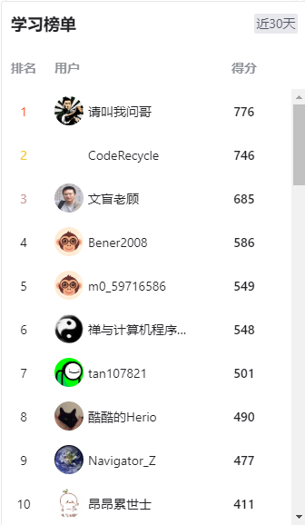
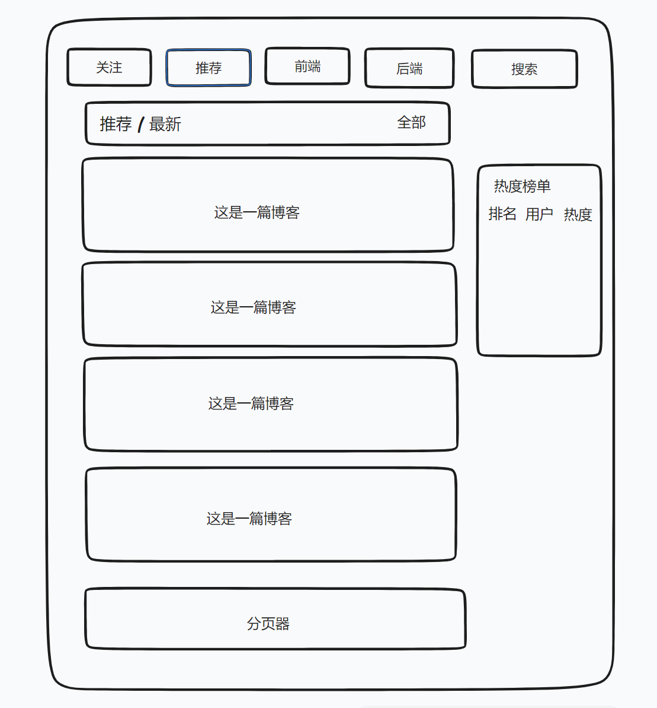
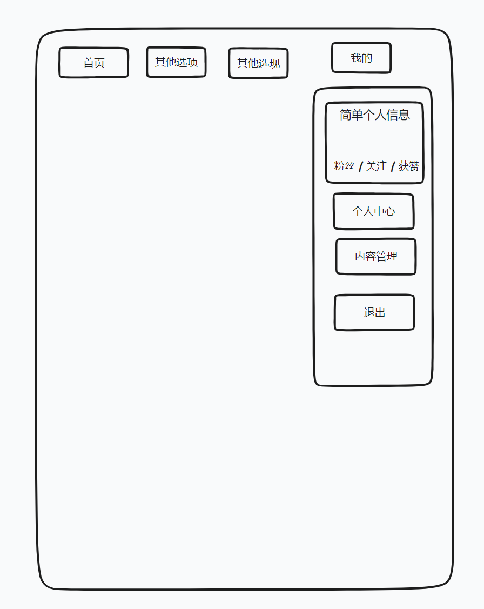
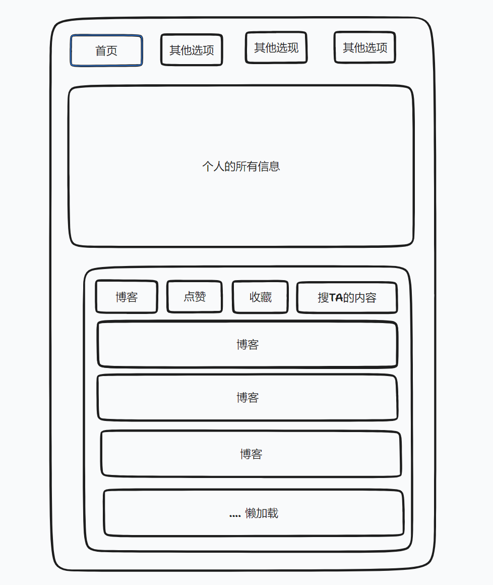
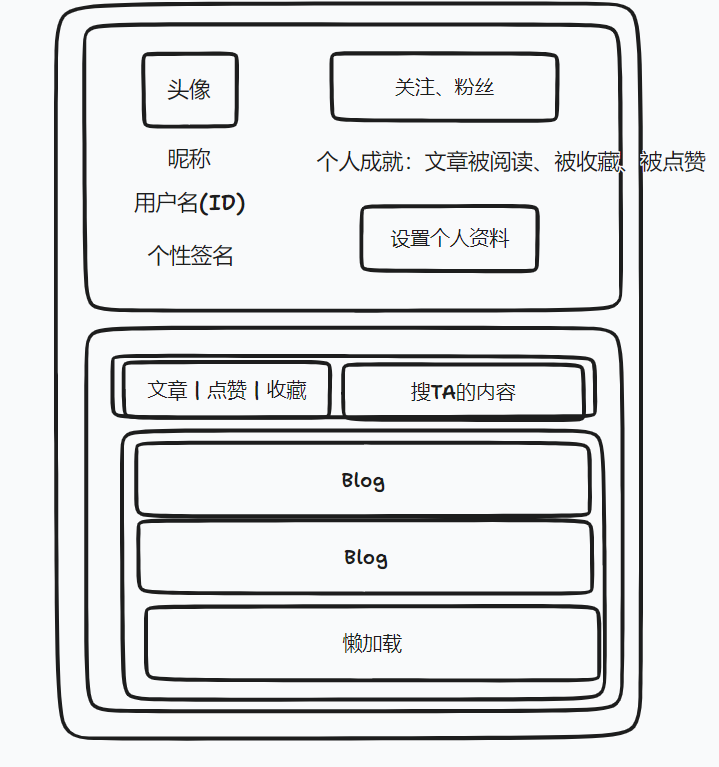
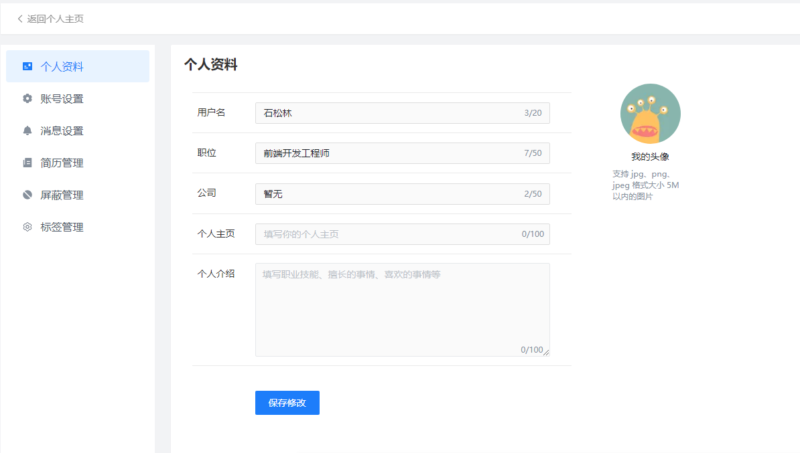
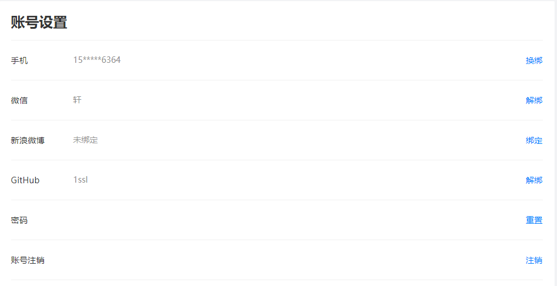
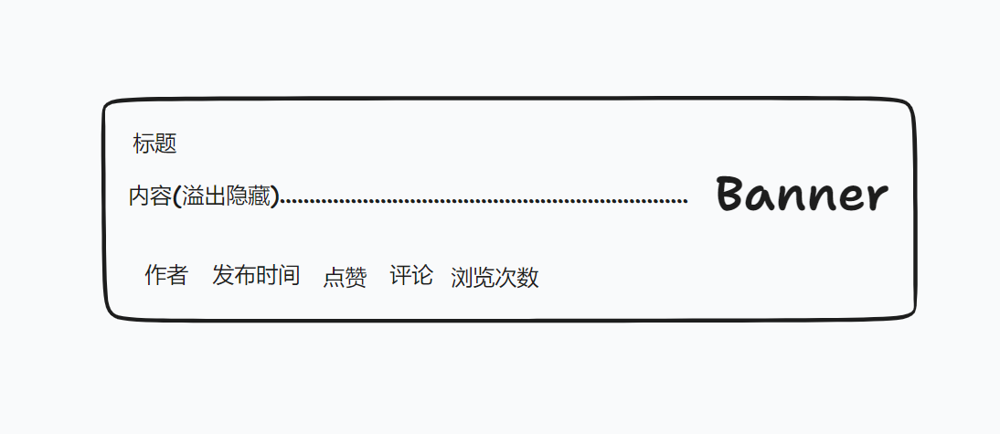
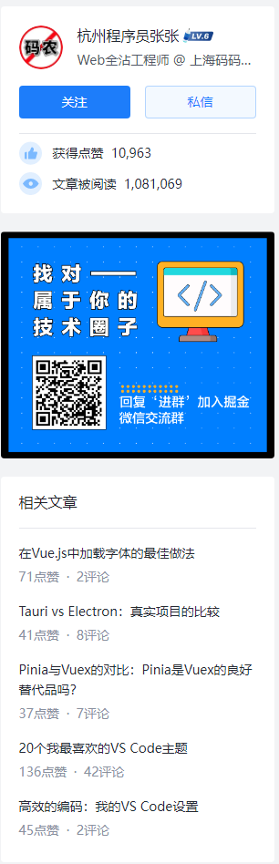
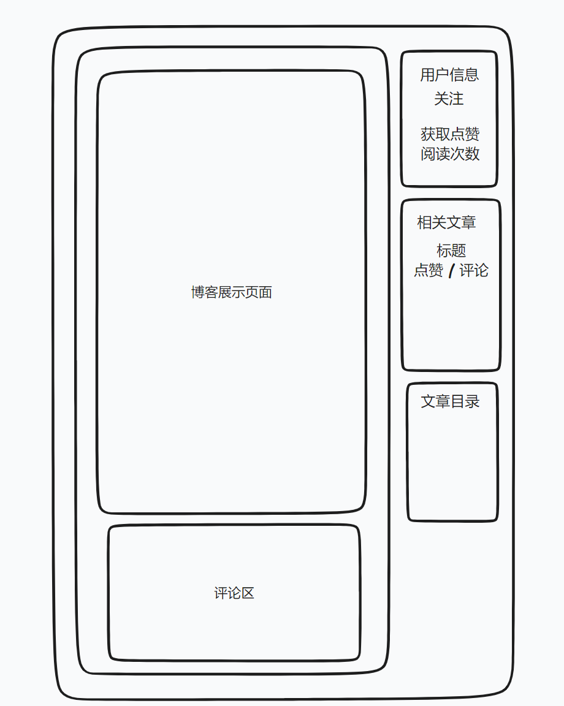

## 页面设计

### 1、首页

> 首页为 菜单栏之一
>
> 灵感来源：小红书、CSDN、稀土掘金

1.  作为一个大厅，这个大厅将展示所有用户发表的博客
2.  可以查看不同的类型的博客(根据分类)
3.  可以对博客进行检索

```js
// 首页介绍
/*
	1. 大厅  -->  展示所有用户发表的博客
*/
```




```js
// 第 1 版(备用)

// 首页将包含以下
/*
	1. 发现  -->  展示所有用户发表博客(默认)
	2. 关注  -->  只查看自己关注的用户发表的博客
*/

// 1. 发现
/*
	1. 推荐     -->  展示所有类型的博客(默认)
	2. 前端     -->  只展示前端类型的博客
	3. 后端     -->  只展示后端类型的博客
	4. 前端基础  -->  只展示前端基础类型的博客
	5. 前端框架  -->  只展示后端基础类型的博客
	6. 后端基础  -->  只展示后端基础类型的博客
	7. 后端框架  -->  只展示后端框架类型的博客
	8. 工具     -->  展示工具的类型的博客(如Git等)
*/

// 2. 关注
/*
	1. 只展示自己关注的用户发表的博客
*/
```

```js
// 第 2 版

// 首页将包含以下
/*
	1. 关注
	2. 推荐
	3. 前端
	4. 后端
	5. 工具
*/
```

```js
// 第 3 版
/*
	1. 导航栏
		1. 关注
		2. 推荐(默认)  -->  包含前后端
		3. 前端
		4. 后端
	2. 内容
		1. 显示顺序(推荐/最新)
			1. 推荐 --> 按照热度
			2. 最新 --> 时间倒序
		2. 内容筛选
			1. 前端
			2. 后端
*/
```


#### 1、首页 原型图(第 1 版)



### 5、我的

> 我的为 菜单栏之一，在页面的右上角 鼠标移入显示、移出隐藏


```js
// 第 1 版

// 我的将包含以下
/*
	1. 简单的个人信息
		1. 头像
		2. 昵称
		3. 粉丝 / 关注 / 获赞
	2. 个人中心
	3. 内容管理
	4. 退出
*/
```

#### 1、我的 原型图(第 1 版)



### 6、个人主页

> 个人主页 将展示用户的一些个人信息，以及其相关的一些东西 ( 收藏... )

```js
// 第 1 版

// 我的将包含以下
/*
	1. 个人信息  -->  显示当前用户的个人信息
		1. 头像
		2. 昵称
		3. 个性签名
		4. 关注 / 粉丝 / 点赞(被他人) / 收藏(被收藏)
	2. 博客  -->  按照时间倒序显示当前用户发表的博客
	2. 收藏  -->  显示收藏的博客
	3. 点赞  -->  显示点赞的博客
*/
```

#### 1、个人主页 原型图(第 1 版)



#### 2、个人主页 原型图(第 2 版)



### 7、设置页面






### 8、博客展示

> 博客展示：每条博客对外展示的样子

#### 1、博客展示 原型图(第 1 版)



### 9、博客详情

> 博客详情：每条博客的具体展示内容
>
> 灵感来源：稀土掘金 -- 博客详情

```js
// 博客详情的详细功能介绍
/*
	1. 滚动条到一定位置菜单栏隐藏
	2. 滚动条到一定位置文章目录固定
	3. 滚动条上划菜单栏显示
*/
```



#### 博客详情 原型图(第 1 版)




