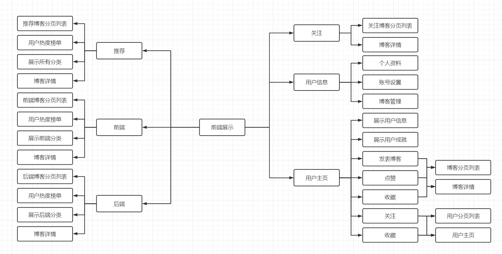
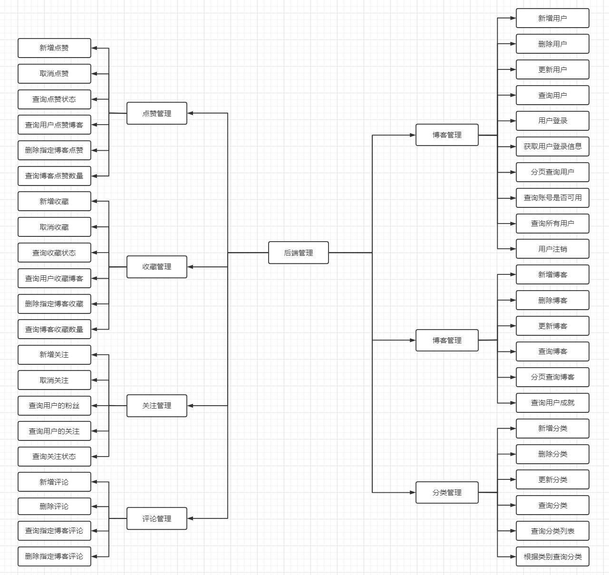
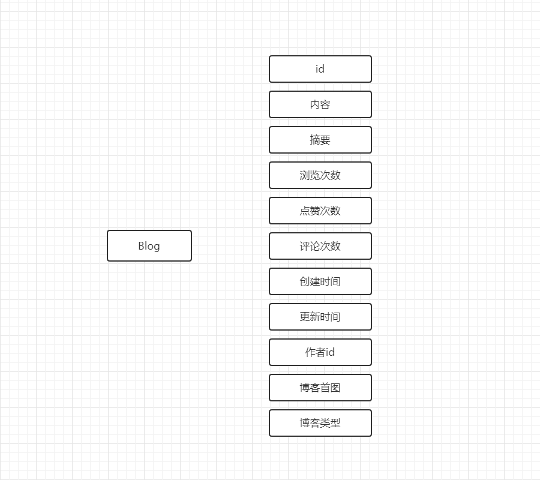
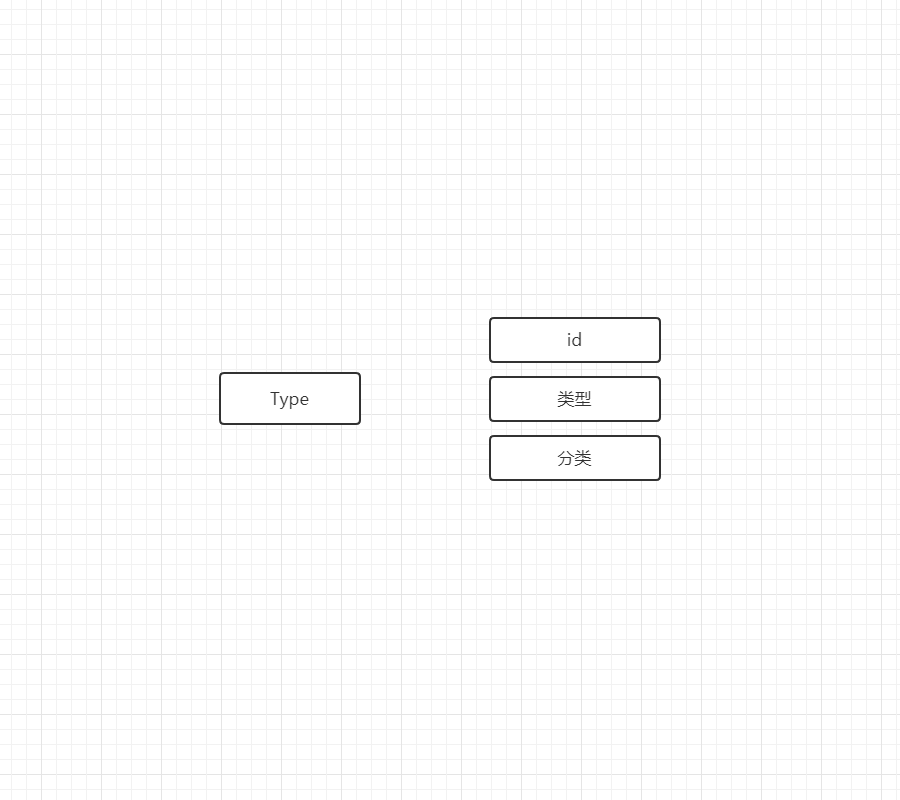
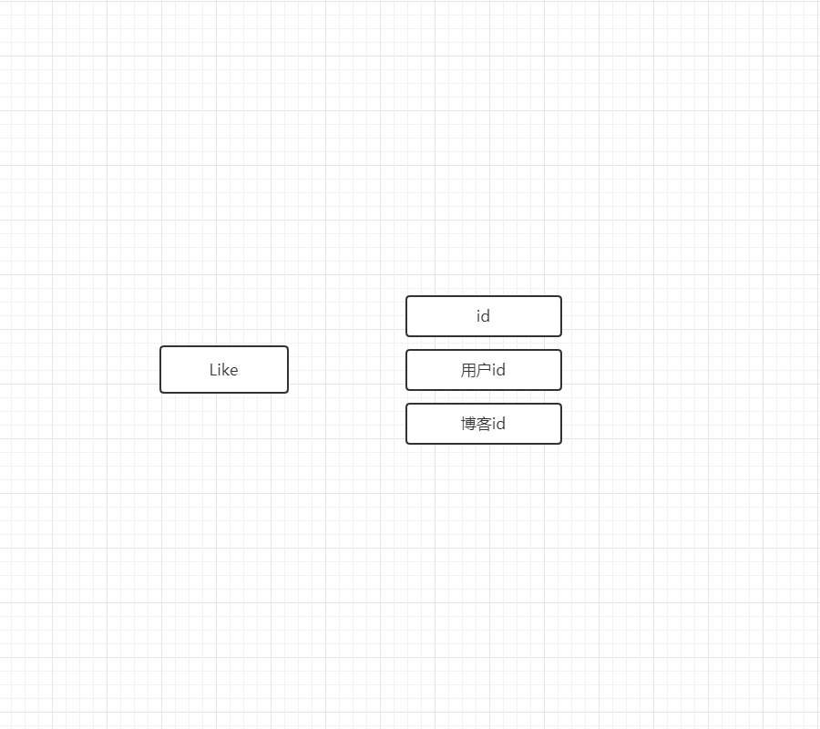
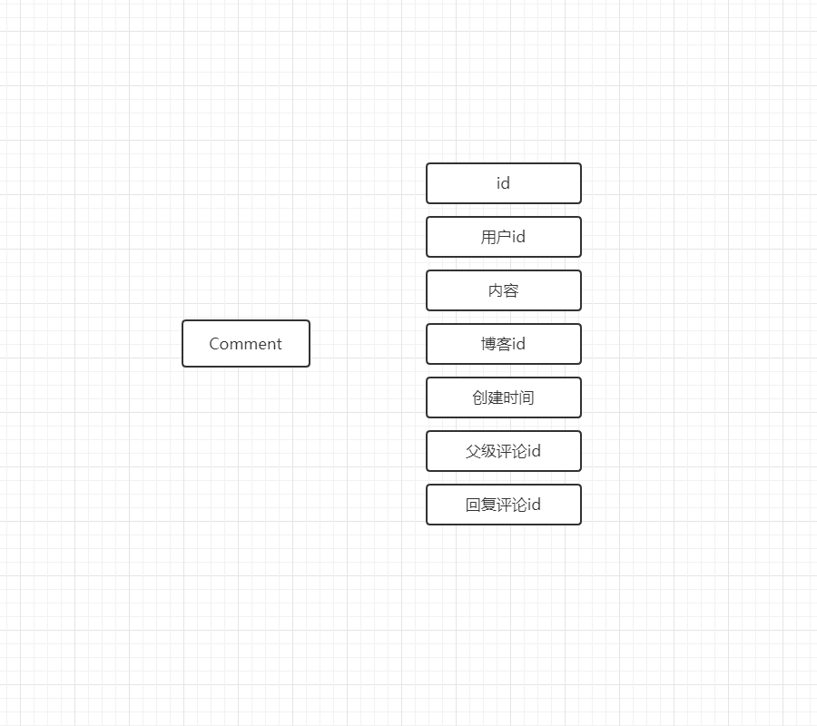
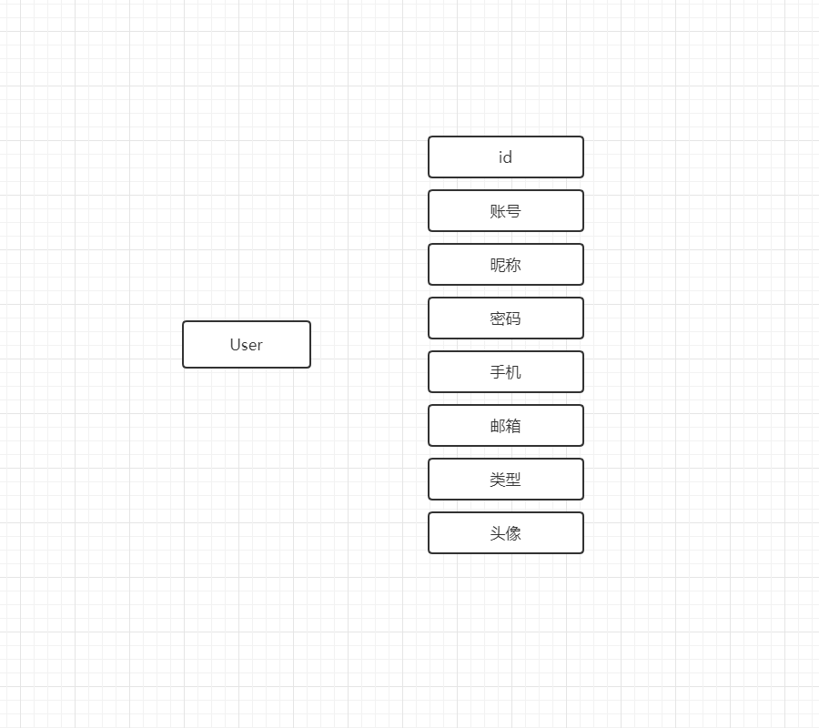
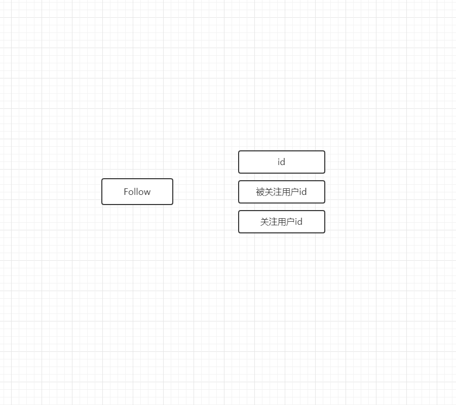

# 基于 Vue3 + SpringBoot 开发的多人博客系统

> 作者：石松林

## 多人博客系统功能：

> 由于页面篇幅有限，所以将博客系统的前端功能和后端功能分开展示

### 前端功能

### 后端功能

### 技术组合：

- 前端：Vue3
- 后端：SpringBoot + MyBatisPlus + Redis
- 数据库：MySQL

### 工具与环境：

- Visual Studio Code
- IDEA
- JDK 8

## 实体类设计

### 实体类

- 博客 Blog
- 博客分类 Type
- 博客点赞 Like
- 博客收藏 Collect
- 博客评论 Comment
- 用户 User
- 用户关注和粉丝 Follow

### 实体关系

### Blog 类

### Type 类

### Like 类

### Collect 类

### Comment 类

### User 类

### Follow 类

## 应用分层

